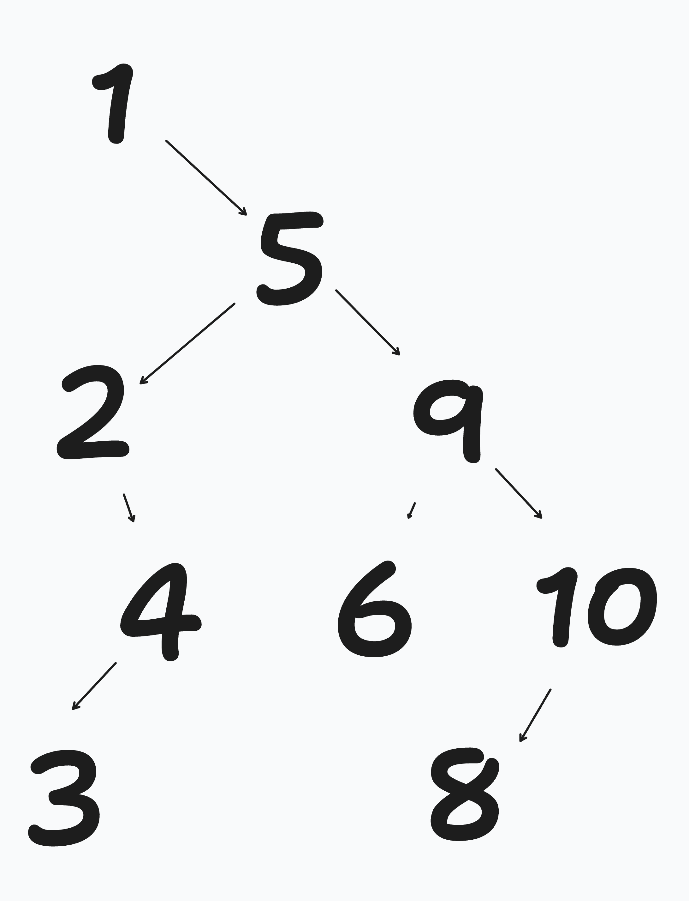

```python 
class TreeNode: 
    def __init__(self, value, left=None, right=None):
        self.value = value 
        self.left_child = left
        self.right_child = right 

# searching a Binary Search Tree of nodes 
def search(search_value, node):
    if not node or node.value == search_value: 
        return node 
    elif search_value < node.value: 
        return search(search_value, node.left_child)
    else: 
        return search(search_value, node.right_child) 

def insert(value, node): 
    if value < node.value:
        if not node.left_child:
            node.left_child = TreeNode(value) 
        else: 
            insert(value, node.left_child) 
    elif value > node.value:
        if not node.right_child: 
            node.right_child = TreeNode(value) 
        else: 
            insert(value, node.right_child) 

# deletion in Binary Search Tree is replacing with successor node 
def replace_with_successor_node(node): 
    successor_node = node.right_child 
    if not successor_node.left_child: 
        node.value = successor_node.value 
        node.right_child = successor_node.right_child 
        return 
    while successor_node.left_child: 
        parent_of_succ = successor_node 
        successor_node = successor_node.left_child 

        if successor_node.right_child: 
            parent_of_succ.left_child = successor_node.right_child 
        else: 
            parent_of_succ.left_child = None 

        node.value = successor_node.value 
        return successor_node

def deletion(node, value_to_delete):
    curr = node
    parent_of_curr = None

    # Step 1: Search for the node to delete
    while curr:
        if curr.value == value_to_delete:
            break
        parent_of_curr = curr
        if value_to_delete < curr.value:
            curr = curr.left_child
        else:
            curr = curr.right_child

    if not curr:  # Node with value_to_delete not found
        return node

    # Step 2: Handle the three cases
    # Case 1: Node is a leaf
    if not curr.left_child and not curr.right_child:
        if not parent_of_curr:  # Deleting the root node
            return None
        if parent_of_curr.left_child == curr:
            parent_of_curr.left_child = None
        else:
            parent_of_curr.right_child = None

    # Case 2: Node has one child
    elif not curr.left_child or not curr.right_child:
        child = curr.left_child if curr.left_child else curr.right_child
        if not parent_of_curr:  # Deleting the root node
            return child
        if parent_of_curr.left_child == curr:
            parent_of_curr.left_child = child
        else:
            parent_of_curr.right_child = child

    # Case 3: Node has two children
    else:
        # Find the in-order successor (smallest value in the right subtree)
        successor = curr.right_child
        successor_parent = curr
        while successor.left_child:
            successor_parent = successor
            successor = successor.left_child

        # Replace current node's value with successor's value
        curr.value = successor.value

        # Delete the successor node
        if successor_parent.left_child == successor:
            successor_parent.left_child = successor.right_child
        else:
            successor_parent.right_child = successor.right_child

    return node

def traverse_and_print(node): 
    if not node: 
        return 
    traverse_and_print(node.left_child) 
    print(node.value) 
    traverse_and_print(node.right_child) 
``` 

## Question I
Note that this binary search tree is not balanced since not every node has two children. 


## Question II 

Searching a BST is log(N), so if N=1000, I would expect search to take about 10 steps. 

## Question III 

The greatest value in a BST will always be the right-most left node. 

```python 

def max(node): 
    if node.right_child: 
        return 
    max(node.right_child)
    else: 
        return node.value

```
## Question IV 

The pre-order traversal visits left subtree first and then the right subtree. It's still depth first! 

1. Moby Dick 
2. Great Expectations 
3. Alice in Wonderland 
4. Lord of the Flies 
5. Robinson Crusoe 
6. Pride and Prejudice 
7. The Odyssey

## Question V 

The post-order traversal visits the left subtree and then the right subtree and then finally the root. 

1. Alice in Wonderland 
2. Lord of the Flies 
3. Great Expectations 
4. Pride and Prejudice 
5. The Odyssey 
6. Robinson Crusoe 
7. Moby Dick  
